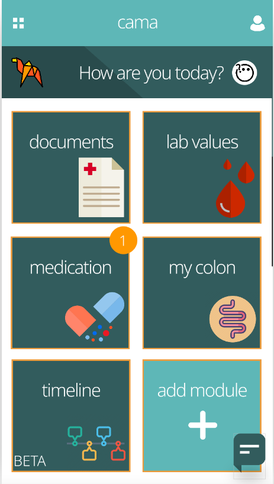

# cama
My cancer manager

Winner team of the [Cancer Management Hackathon
](https://www.healthhackers.de/cancermanagementhackathon/) by Krebskriegerin and Health Hackers e.V.
2019/10/20

## Code

to build this repository we used [expo](https://expo.io/) with react-native. You can run the code by

```
npm install
npm start
```
the main dependencies were:

- [react-native-calendars](https://github.com/wix/react-native-calendars)
- [react-native-echarts-wrapper](https://www.npmjs.com/package/react-native-echarts-wrapper)
- [echarts](https://echarts.apache.org/examples/en/)

## Wireframe

We build a wireframe with Invision



https://ginhealthhackers.invisionapp.com/prototype/chat-ck1ym46uw000um801hh5vr10e/play/74117397

## Slides

slides can be found on [Google Slides](https://docs.google.com/presentation/d/1axs5PVbyGnlPjV0YBAg1m_F0pM9kIcy5J1-uwhQDMdQ/edit?usp=sharing)


https://docs.google.com/presentation/d/1axs5PVbyGnlPjV0YBAg1m_F0pM9kIcy5J1-uwhQDMdQ/edit?usp=sharing
---

Icons made by [Smashicons](https://www.flaticon.com/authors/smashicons) from [www.flaticon.com](https://www.flaticon.com/)
